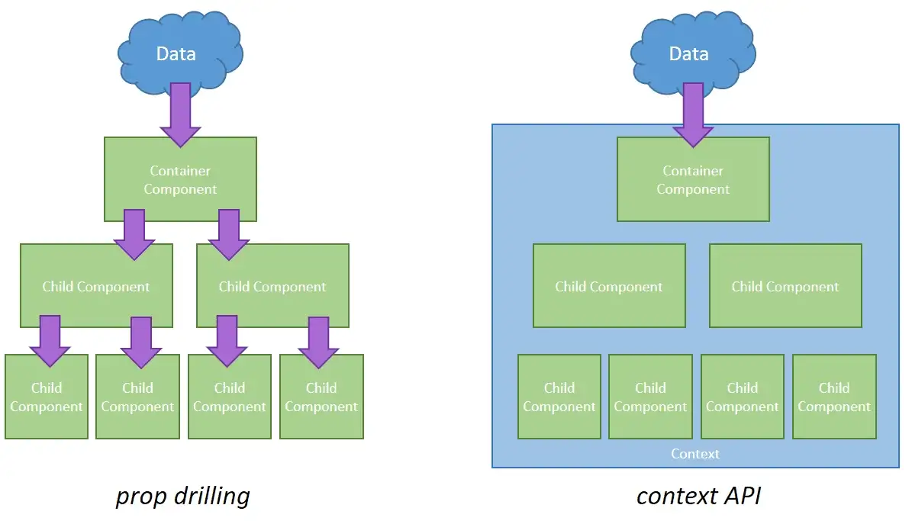

# Store / Context

Context provides a way to pass data through the component tree without having to pass props down manually at every level.[React/Docs](https://reactjs.org/docs/context.html).

In a typical React application, data is passed top-down (parent to child) via props, but such usage can be cumbersome for certain types of props (e.g. locale preference, UI theme) that are required by many components within an application. Context provides a way to share values like these between components without having to explicitly pass a prop through every level of the tree.

Context is built-in react, so it's not required to be installed.

This Figure shows how to pass data from components with/withot context:



<hr />

## Context Getting Started
1. Create Store file:
    
    Create Store file for context in [src](./src/) directory.

2. import `createContext` and `useState` from react.
3. Creates a Context object.

    When React renders a component that subscribes to this Context object it will read the current context value from the closest matching Provider above it in the tree.
    ```js
    export const MyContext = createContext(defaultValue);
    ```
    The defaultValue argument is only used when a component does not have a matching Provider above it in the tree. This default value can be helpful for testing components in isolation without wrapping them. Note: passing undefined as a Provider value does not cause consuming components to use defaultValue.

4. Create Provider:

    Every Context object comes with a Provider React component that allows consuming components to subscribe to context changes.

    The Provider component accepts a value prop to be passed to consuming components that are descendants of this Provider. One Provider can be connected to many consumers. Providers can be nested to override values deeper within the tree.

    All consumers that are descendants of a Provider will re-render whenever the Provider’s value prop changes. The propagation from Provider to its descendant consumers (including .contextType and useContext) is not subject to the shouldComponentUpdate method, so the consumer is updated even when an ancestor component skips an update.

    ```jsx
    export const MyContext = createContext(defaultValue);

    export const Provider = ({children})=>{
        // state object here ...
        const [stateVariable, setStateVariable] = useState(/*Initialize Value*/)
        return(
            <MyContext.Provider value={{stateVariable, setStateVariable}}>
                {children}
            </MyContext.Provider>
        )
    }
    ```

5. Surround [App](./src/App.jsx) with `Provider` in [index.js](./src/index.js) file.
    ```jsx
    import {Provider} from './Store';
    ...
    ...
    root.render(
        <Provider>
            <App />
        </Provider>
    )
    ```
    So All components in App can use the data in Provider.

<hr />

## Use Context In Components:

After creating store and surround App with Provider, Any component in App can use the data (state) in Provider using `useContext()` hook from `react`

```jsx
import MyContext from './Store'
import {useContext} from 'react'
...
...
...
const Component = ()=>{
    const {stateVariable, setStateVariable} = useContext(MyContext);
    ...
    ...
    ...
    return(
        <>
            {/*stateVariable and setStateVariable can be used here...*/}
        </>
    )

}
```

<hr />

## `useRef` Hook:
`useRef` hook in react is an easy way to build and use a controled inputs without useing state, so a variable can bind to the value for the input

```jsx
import {useRef} from 'react'
...
...

const Component = ()=>{
    const inputValue_1 = useRef(/*Initialize value*/)
    const inputValue_2 = useRef(/*Initialize value*/)
        
    // getting values:
    const someHandler = ()=>{
        const v1 = inputValue_1.current.value;
        const v2 = inputValue_2.current.value;
        ...
        // DO SOMETHING WITH V1, V2 ...
    }
    ...
    return(
        ...
        ...
        <input type="text" ref={inputValue_1} />
        <input type="ANY" ref={inputValue_2}  />
        ...
        ...
    )
}
```

## Resources
1. [React Context](https://reactjs.org/docs/context.html).
2. [useRef](https://beta.reactjs.org/reference/react/useRef)
2. [React Bootstrap Getting Started](https://react-bootstrap.github.io/getting-started/introduction).
3. [React Bootstrap Components](https://react-bootstrap.github.io/components/alerts/).


